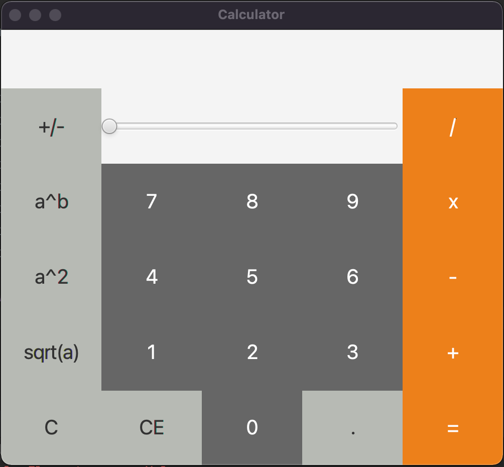

# Calculator

A small calculator written with Java FX for CS 242 class.

## TODO LIST
- [x] GUI layout: 2 points
- [x] Properly working binary operators using buttons: 2 points
- [x] Properly working unary operators using buttons: 2 points
- [x] Use of slider: 2 points
- [x] Use of keys: 2 points
- [x] Entering decimal numbers: 2 points
- [x] Stylizing: 2 points
- [x] Short report: 1 point

## Report
We modeled a lot of behavior similar to OSX and Windows built in calculators. Everything works great we haven't noticed
any bugs. To run it you can clone the repo then run CalculatorApplication in intellij. We couldn't get building jar to
work.